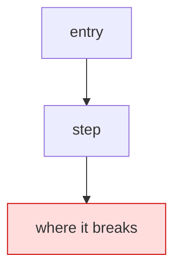
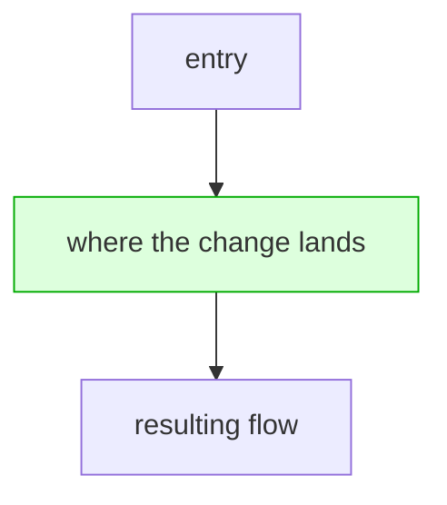

# {short name} — round {N}

Mermaid diagrams (`flowchart TD`) come after the prose in each section, never before: Problem shows the current flow and where it breaks; Implementation shows what is going to happen.

## Problem

What is broken or missing, in plain english, and how to observe it so "fixed" is checkable. For a fix-round: name the prior round's brief and the single functional gap it left open. Scope to that gap only, nothing wider.



## Implementation

- **Decisions made:** every open decision, one line each with its resolution, so the loop inherits zero.
- **How it lands:** order and why, commit strategy, what stays unchanged and what is explicitly untouched.
- **Hygiene:** minimal diff; a comment only where it states a constraint the code cannot show.



## Verification

### Prerequisites (gate before the loop; not a layer)

- `<health command per touched service>` → `<green signal>`
- Client-UI reachability: load the real UI a user touches, sign in, reach the exact surface.

### Scenarios — what we prove (nominal + edges), then the matrix

First enumerate WHAT to prove, co-designed one at a time. **Nominal:** the feature doing its
job, each as the observable that makes "fixed" checkable. **Edges:** walk the standing
checklist and keep what applies (say why you cut the rest): isolation/scope, boundary/malformed
input, failure path, concurrency, repeat/state-across-turns.

Then place each at the cheapest layer that catches it. The matrix is read in one look and
approved/cut/reordered before any prose; status is re-rendered every checkpoint (`not-run` |
`blocked` | `substituted` | `run-for-real`, and `substituted` never counts as a pass):

**Target environment for this round:** `<the deployed shared env by default, with its client
hostname; a local stack is iteration-only and never the completion bar>`. Every row's `env`
reads this target unless the row states why it cannot.

| # | scenario | nominal / edge | layer (api\|ui) | env | assertion (UI result + backend signal) | status |
|---|---|---|---|---|---|---|
| 1 | `<nominal: the feature working>` | nominal | api | `<target>` | `<command → result + backend signal>` | not-run |
| 2 | `<nominal, user-facing>` | nominal | ui | `<target>` | `<drive the real client → rendered answer + backend log line>` | not-run |
| 3 | `<edge, incl. the specific broken occurrence>` | edge | api\|ui | `<target>` | `<assertion>` | not-run |
| H1 | comment hygiene (standing) | hygiene | api | n/a | quote every comment the diff adds; constraint comments only, file's existing density | not-run |
| H2 | build green (standing, if a PR is opened/pushed) | hygiene | api | n/a | the PR's checks all pass, quoted from the checks output; red = fix in-round | not-run |

Each scenario proven executable in prep. Full suite + lint green is its own row. H1/H2 are
standing rows every round: write-time constraints the critic only confirms, never a cleanup
pass after the fact.

### Critic gate (mandatory, fresh context)

A context window that did not write the code reviews the diff and the verification, runs the laziness attack list (hardcoded config, swallowed errors, weakened tests, leftover stubs, slop comments, local workarounds), and POSTs every finding with its disposition (fix diff shown, or rebuttal).

## Binary completion

All layers green (incl. H1 comment hygiene and H2 build green) and demonstrated user-visibly + every critic finding dispositioned + any human follow-up noted.

## Compiled loop condition

```
/goal <prerequisites as a turn-1 gate> ... done means all of: <verification layers as binary
proofs> + <critic gate posted>; <constraint that must not change>; or stop after {N} turns.
```
